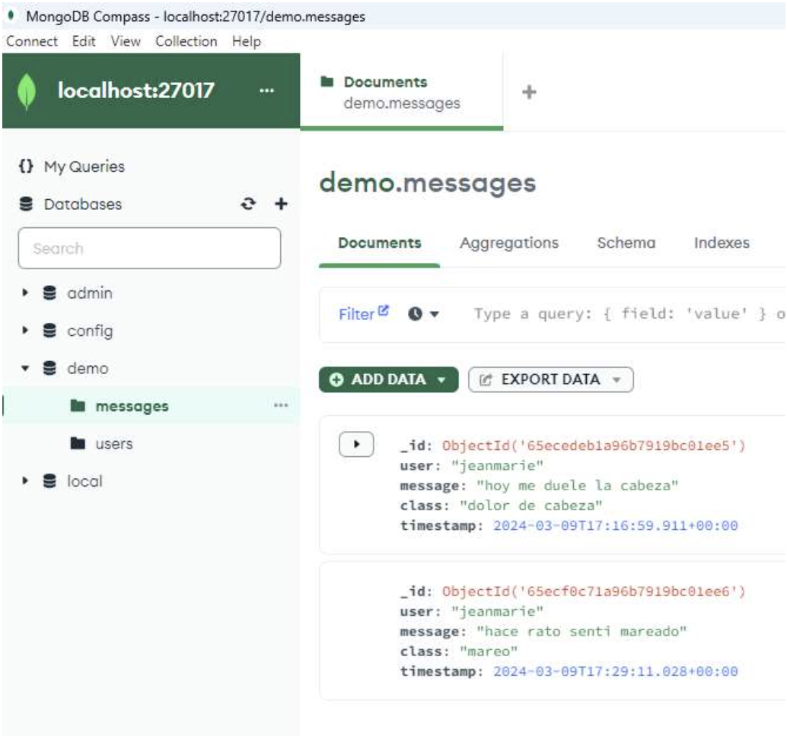

# Crowd Sensing Mobile Application for the Collection and Visualization of Environmental Pollution Data in Mexico
According to the Mexican Center for Environmental Law (CEMDA), Mexico has reached levels of pollution that are worrying for citizens. For example, more than 547,000 tons of carbon dioxide are discharged annually. However, data to corroborate the spatio-temporal distribution of environmental pollution within Mexico are often irregular, and are acquired from a dispersed distribution of few and very expensive monitoring stations, which also do not cover the entire country. For this reason, with the lower prices of smartphones that come with a variety of sensors, along with the intrinsic mobility of their users, an approach has been contemplated to acquire local data from people's immediate surroundings or even from themselves, these Data are indicators of people's health which will be collected daily using the crowd-sensing technique. Crowd sensing is an approach that involves a large, dispersed group of participants using mobile devices with the objective of receiving/sending reliable data from the field. So with this technique you can collect data without high investment costs since nowadays almost everyone brings a smartphone with them. With the participation of IPN students and staff, and other volunteer users dispersed throughout the country, who will have access to the application developed in this project, it will be possible to achieve a collection, interpretation and visualization of reliable distribution data in space and time of environmental pollution within Mexico with minimal investment.

